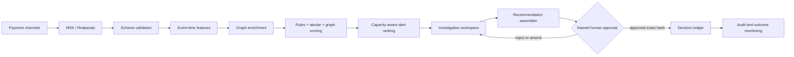

# Architecture

PulseLedger is a portfolio-grade reference implementation for human-centred, real-time financial-crime investigation. It separates a locally runnable proof from a production AWS target so interview discussion remains technically ambitious and commercially honest.

## Local proof and AWS target

| Concern            | Local proof                          | AWS target                        | Design reason                                  |
| ------------------ | ------------------------------------ | --------------------------------- | ---------------------------------------------- |
| Event log          | Redpanda                             | Amazon MSK                        | Durable replay and consumer isolation          |
| Stateful streaming | deterministic Python generator       | Managed Service for Apache Flink  | event-time windows, checkpoints and late data  |
| Graph              | Neo4j container / checked-in fixture | Amazon Neptune                    | bounded traversals and relationship evidence   |
| Decision API       | Next.js route handlers               | Lambda or EKS behind API Gateway  | small contract surface and independent scaling |
| Decision ledger    | in-memory demo store                 | DynamoDB with PITR                | idempotent, traceable approvals                |
| Evidence archive   | JSON evidence pack                   | versioned KMS-encrypted S3        | reproducibility and investigation audit        |
| Operations         | health, metrics, SSE                 | CloudWatch, OpenTelemetry, alarms | observable from event to decision              |

## Failure boundaries

- Ingestion acknowledges only after durable event-log commit.
- Invalid contracts route to quarantine; they never silently become zero-valued features.
- Feature calculations retain event time, definition version, watermark and source offsets.
- Graph traversal is depth- and cardinality-bounded; timeout falls back to non-graph scoring with visible degraded status.
- An alert is a prioritisation unit, not a customer action.
- A material proposal carries a short-lived, exact payload hash. Mutation requires a new approval.
- The decision ledger is append-only in the target design. Reversals create new records.

## Non-functional targets

The intended production envelope is 3,000 average and 10,000 peak events per second, 99.95% scoring availability, P95 end-to-end alert creation under 800 ms, recovery point under one minute, recovery time under thirty minutes, and full event-to-decision trace coverage. These are design targets, not measured production results.
